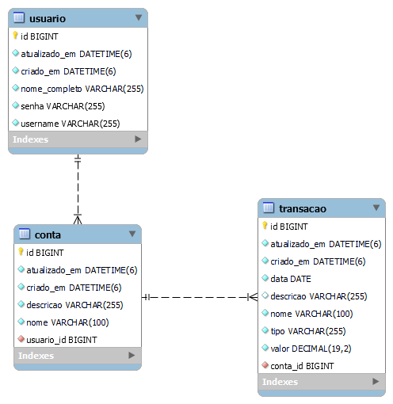

# Desafio: Gastos Pessoais

  

  Gastos Pessoais by <a href="https://github.com/CleysonPH">CleysonPH</a>

  API para gerencimento de gastos pessoais

## índice

- [Descrição](#descrição)
- [Rotas](#rotas)
- [Diagrama Banco de Dados](#diagrama-banco-de-dados)
- [Requisitos](#requisitos)
- [Casos de Uso](#casos-de-uso)

## Descrição

Seu desafio é criar uma API para realizar o gerenciamento de gastos pessoais.

## Rotas

| Rota                                | Verbo HTTP | Requer de Autenticação? | Descrição                                                                         |
|-------------------------------------|------------|-------------------------|-----------------------------------------------------------------------------------|
| /api/v1/usuarios                    | POST       | Não                     | Rota responsável por cadastrar um novo usuário                                    |
| /api/v1/auth/token                  | POST       | Não                     | Rota responsavél por gerar tokens de acesso a partir das credenciais do   usuário |
| /api/v1/auth/refresh                | POST       | Não                     | Rota responsavél por gerar tokens de acesso a partir de um refresh token          |
| /api/v1/me                          | GET        | Sim                     | Rota responsavél por exibir os dados do usuário logado                            |
| /api/v1/me                          | PUT        | Sim                     | Rota responsavél por editar os dados do usuário logado                            |
| /api/v1/me/alterar-senha            | PUT        | Sim                     | Rota responsavél por alterar a senha do usuário logado                            |
| /api/v1/contas                      | GET        | Sim                     | Rota responsável por exibir as contas cadastradas pelo usuário logado             |
| /api/v1/contas                      | POST       | Sim                     | Rota responsável por cadastrar uma nova conta                                     |
| /api/v1/contas/{contaId}            | GET        | Sim                     | Rota responsável por exibir os dados de uma conta                                 |
| /api/v1/contas/{contaId}            | PUT        | Sim                     | Rota responsável por editar os dados de uma conta                                 |
| /api/v1/contas/{contaId}            | DELETE     | Sim                     | Rota responsável por excluir uma conta                                            |
| /api/v1/contas/{contaId}/saldo      | GET        | Sim                     | Rota responsável por exibir o saldo de uma conta                                  |
| /api/v1/contas/{contaId}/transacoes | GET        | Sim                     | Rota responsável por exibir as transações associadas a uma conta                  |
| /api/v1/transacoes                  | GET        | Sim                     | Rota responsável por exibir as transações cadastradas pelo usuário logado         |
| /api/v1/transacoes                  | POST       | Sim                     | Rota responsável por cadastrar uma nova transação                                 |
| /api/v1/transacoes/{transacaoId}    | GET        | Sim                     | Rota responsável por exibir os dados de uma transação                             |
| /api/v1/transacoes/{transacaoId}    | PUT        | Sim                     | Rota responsável por editar os dados de uma transação                             |
| /api/v1/transacoes/{transacaoId}    | DELETE     | Sim                     | Rota responsável por excluir uma transação                                        |

## Diagrama Banco de Dados

A aplicação terá três tabelas que irão se relacionar entre si, sendo elas a tabela `usuario`, a tabela `conta` e a tabela `transacao`.

## Requisitos

- [Requisitos Funcionais](./requisitos-funcionais.md)
- [Requisitos Não Funcionais](./requisitos-nao-funcionais.md)

## Casos de Uso

- [Usuário](./casos-de-uso-usuario.md)
- [Conta](./casos-de-uso-conta.md)
- [Transação](./casos-de-uso-transacao.md)